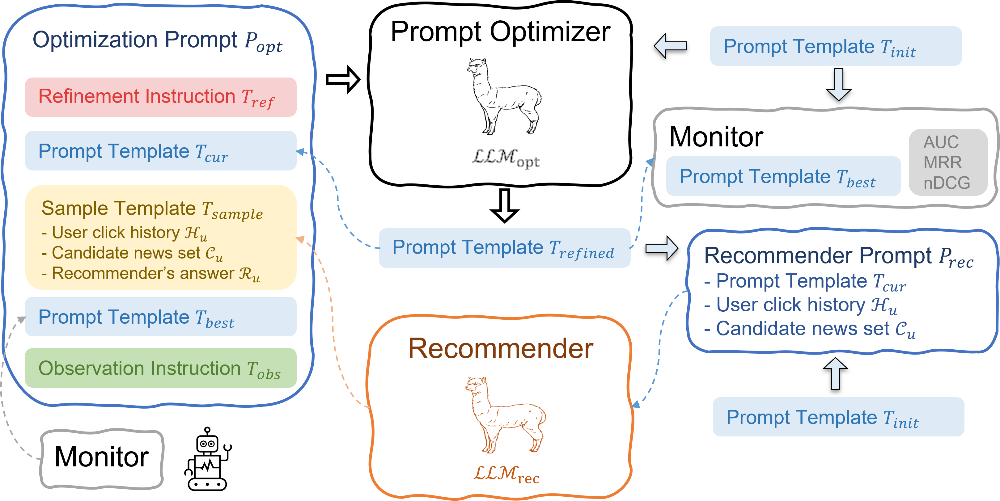

# RecPrompt: A Self-tuning Prompting Framework for News Recommendation Using Large Language Models

RecPrompt is the first prompt engineering framework that integrates a series of intermediate reasoning steps for news recommendation, leveraging the capabilities of LLMs to perform complex news recommendation tasks. This framework incorporates a prompt optimizer that applies an iterative bootstrapping process, significantly improving the alignment of news content with user preferences.




You should first create a JSON file under config/ with the following API_KEY:
```json
{
  "OPENAI_API_KEY": "YOUR OPEN API KEY",
  "HF_TOKEN": "YOUR HUGGINGFACE TOKEN"
}
```

Running the framework requires the following steps:
1. Install the required libraries by running `pip install -r requirements.txt`
2. Execute the RecPrompt optimizing script by running `python framework/run_rec_prompt.py`
3. Execute the recommendation task to reproduce the results by running `python framework/run_rec_test.py`
4. Execute evaluation of TopicScore by running `python evaluation/evaluate_news_topics.py`
