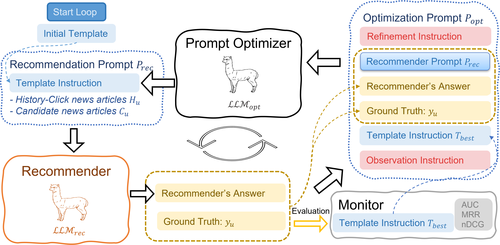
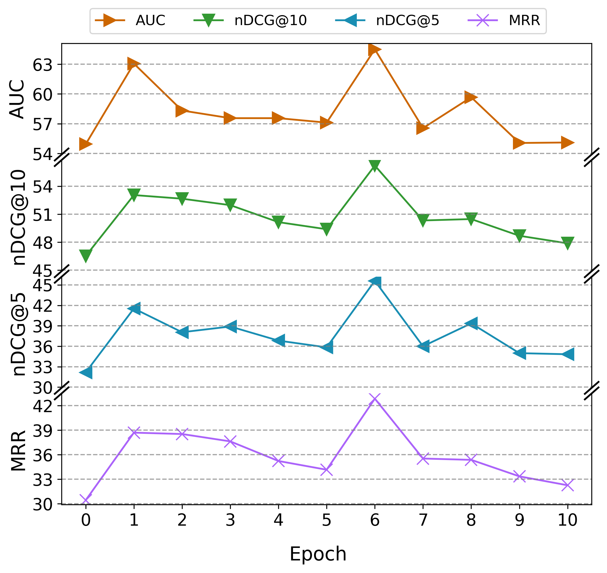

# RecPrompt: A Self-tuning Prompting Framework for News Recommendation Using Large Language Models

RecPrompt is the first prompt engineering framework that integrates a series of intermediate reasoning steps for news recommendation, leveraging the capabilities of LLMs to perform complex news recommendation tasks. This framework incorporates a prompt optimizer that applies an iterative bootstrapping process, significantly improving the alignment of news content with user preferences.



### Initial Template Instructions:

### Optimization Prompt:


To set up the project, you should first create a JSON file under config/ named api_keys.json with the following API_KEY:
```json
{
  "OPENAI_API_KEY": "YOUR OPEN API KEY",
  "HF_TOKEN": "YOUR HUGGINGFACE TOKEN"
}
```

Running the framework requires the following steps:
1. Install the required libraries by running `pip install -r requirements.txt`
2. Execute the RecPrompt optimizing script by running `python framework/run_rec_prompt.py --tuning_list=3tune3_io,4tune3_io`
3. Execute the recommendation task to reproduce the results by running `python framework/run_rec_test.py`
4. Execute evaluation of TopicScore by running `python evaluation/evaluate_news_topics.py`

### Tuning Procedure
The following table shows the tuning procedure for the RecPrompt framework using GPT-3.5 as the news recommender. The framework is tuned using the IO and CoT prompts with GPT-3.5 and GPT-4 as prompt optimizer.

| Template |                     Tuned by GPT-3.5                     |                      Tuned by GPT-4                      |
|----------|:--------------------------------------------------------:|:--------------------------------------------------------:|
| IO       |    |    |
| CoT      |  |  |

### TopicScore Evaluation prompt for LLM_eval:

### Human Annotation example:


### Recommendation Performance:
| **Model**         | AUC               | MRR               | nDCG@5            | nDCG@10           |
|-------------------|-------------------|-------------------|-------------------|-------------------|
| **Simple Model**  |                   |                   |                   |                   |
| Random            | 50.89±2.23        | 30.30±1.17        | 30.47±1.99        | 46.22±0.99        |
| MostPop           | 52.47±0.04        | 34.99±0.01        | 34.68±0.05        | 49.77±0.01        |
| TopicPop          | 64.64±0.04        | 39.35±0.07        | 44.39±0.08        | 53.59±0.05        |
| **Deep Model**    |                   |                   |                   |                   |
| LSTUR             | <u>67.17±0.22</u> | 43.76±0.30        | 47.84±0.23        | 57.00±0.23        |
| DKN               | 66.28±0.43        | 42.31±0.50        | 46.43±0.37        | 55.88±0.38        |
| NAML              | 66.79±0.10        | <u>44.03±0.46</u> | <u>48.03±0.35</u> | <u>57.18±0.34</u> |
| NPA               | 65.52±0.78        | 43.16±0.40        | 46.53±0.47        | 56.47±0.32        |
| NRMS              | 66.25±0.12        | 43.60±0.30        | 46.86±0.25        | 56.82±0.21        |
| **Prompt LLM**    |                   |                   |                   |                   |
| IO-LLM-rec-3.5    | 59.08±0.23        | 38.55±0.15        | 40.35±0.38        | 52.74±0.21        |
| CoT-LLM-rec-3.5   | 58.67±0.14        | 37.66±0.35        | 39.12±0.26        | 52.06±0.41        |
| IO-LLM-rec-4      | 65.06±0.14        | 43.62±0.13        | 46.66±0.24        | 56.78±0.06        |
| CoT-LLM-rec-4     | 66.06±0.18        | 44.01±0.29        | 48.02±0.34        | 57.12±0.17        |
| **RecPrompt**     |                   |                   |                   |                   |
| IO-LLM-rec-3.5    | 62.28±0.14        | 39.53±0.12        | 43.65±0.32        | 53.65±0.25        |
| CoT-LLM-rec-3.5   | 64.73±0.32        | 42.22±0.23        | 46.33±0.11        | 55.75±0.19        |
| IO-LLM-rec-4      | 69.39±0.21        | 48.2±0.34         | 52.01±0.37        | 60.39±0.29        |
| CoT-LLM-rec-4     | **69.43±0.04**    | **48.65±0.32**    | **52.66±0.43**    | **60.73±0.24**    |
| **Increment->DM** | (+3.36%)          | (+10.49%)         | (+9.64%)          | (+6.20%)          |


### Evaluation Results of TopicScore:
